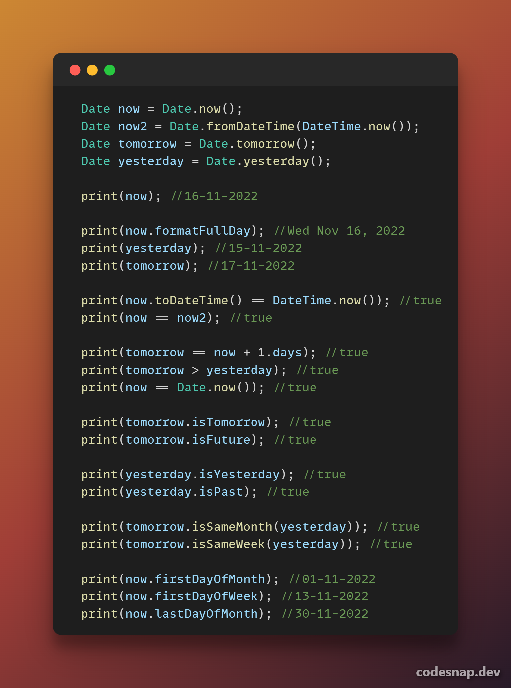
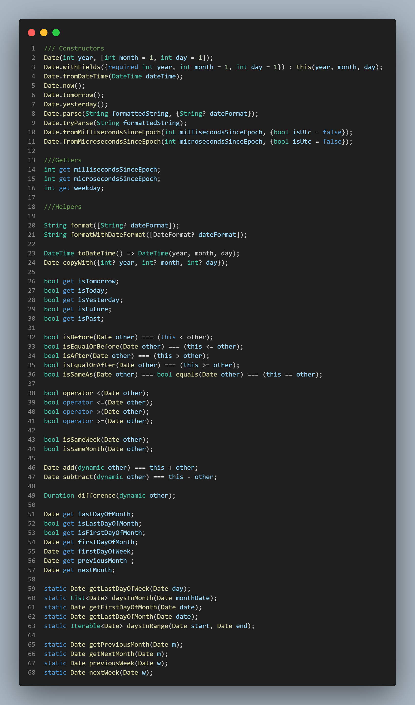

This is a Date only field in flutter
It is almost the same logic as DateTime but without the time part
## Features

Easily split Date only fields and deal with them. 




## Getting started

Add to your dependencies:
````dart
dependencies:
    
    date_only_field: ^0.0.13
````
Import the package:
```dart
/// Use this if you need to import Date field only
import 'package:date_only_field/date_only_field.dart';

/// Use this if you need to import Date field with duraion extensions
import 'package:date_only_field/date_only_field_with_extensions.dart';

/// Use this if you need to import duraion extensions only
import 'package:date_only_field/num_durations_extensions.dart';
```

## Usage

```dart
Date now = Date.now();
Date yesterday = now - 1.days;
Date tomorrow = now + 1.days;

print('now = $now');
print('yesterday = $yesterday');
print('tomorrow = $tomorrow');
print('tomorrow > yesterday : ${tomorrow > yesterday}');
print('now == Date.now() : ${now == Date.now()}');
print('now first Day Of this Month: ${now.firstDayOfMonth}');
print('now first Day Of this Week: ${now.firstDayOfWeek}');
print('now last Day Of this Month: ${now.lastDayOfMonth}');
```
Output:
```
now = 05-11-2022
yesterday = 04-11-2022
tomorrow = 06-11-2022
tomorrow > yesterday : true
now == Date.now() : true
now first Day Of this Month: 01-11-2022
now first Day Of this Week: 30-10-2022
now last Day Of this Month: 30-11-2022
```

## Helpers
```dart

/// Constructors
Date(int year, [int month = 1, int day = 1]);
Date.withFields({required int year, int month = 1, int day = 1}) : this(year, month, day);
Date.fromDateTime(DateTime dateTime);
Date.now();
Date.tomorrow();
Date.yesterday();
Date.parse(String formattedString, {String? dateFormat});
Date.tryParse(String formattedString);
Date.fromMillisecondsSinceEpoch(int millisecondsSinceEpoch, {bool isUtc = false});
Date.fromMicrosecondsSinceEpoch(int microsecondsSinceEpoch, {bool isUtc = false});

///Getters
int get millisecondsSinceEpoch;
int get microsecondsSinceEpoch;
int get weekday;

///Helpers

String format([String? dateFormat]);
String formatWithDateFormat([DateFormat? dateFormat]);

DateTime toDateTime() => DateTime(year, month, day);
Date copyWith({int? year, int? month, int? day});

bool get isTomorrow;
bool get isToday;
bool get isYesterday;
bool get isFuture;
bool get isPast;

bool isBefore(Date other) === (this < other);
bool isEqualOrBefore(Date other) === (this <= other);
bool isAfter(Date other) === (this > other);
bool isEqualOrAfter(Date other) === (this >= other);
bool isSameAs(Date other) === bool equals(Date other) === (this == other);

bool operator <(Date other);
bool operator <=(Date other);
bool operator >(Date other);
bool operator >=(Date other);

bool isSameWeek(Date other);
bool isSameMonth(Date other);

Date add(dynamic other) === this + other;
Date subtract(dynamic other) === this - other;

Duration difference(dynamic other);

Date get lastDayOfMonth;
bool get isLastDayOfMonth;
bool get isFirstDayOfMonth;
Date get firstDayOfMonth;
Date get firstDayOfWeek;
Date get previousMonth ;
Date get nextMonth;

static Date getLastDayOfWeek(Date day);
static List<Date> daysInMonth(Date monthDate);
static Date getFirstDayOfMonth(Date date);
static Date getLastDayOfMonth(Date date);
static Iterable<Date> daysInRange(Date start, Date end);

static Date getPreviousMonth(Date m);
static Date getNextMonth(Date m);
static Date previousWeek(Date w);
static Date nextWeek(Date w);

```

Any features needed will be added. Just tell me.
